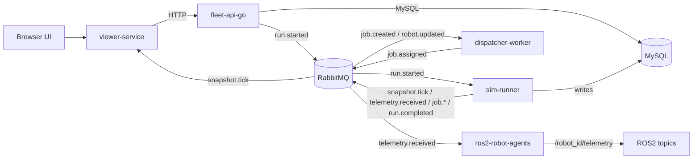
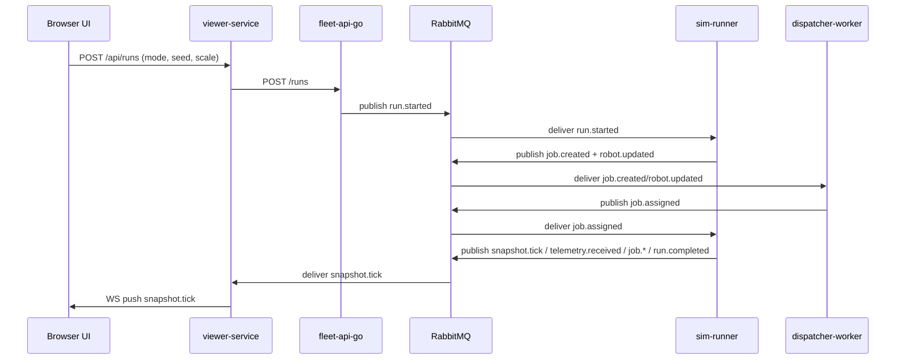

# Architecture

This repository implements a deterministic AMR fleet simulation with two dispatch modes (baseline heuristic and GA optimizer). All eventing is routed through RabbitMQ (`amr.events`), and results are persisted in MySQL. The UI is served by `viewer-service` and streams simulation snapshots over WebSocket.

## System Components

- **viewer-service (FastAPI)**: Serves the HTML/JS dashboard and a small proxy API. Consumes `snapshot.tick` from RabbitMQ and forwards to browser clients via WebSocket.
- **fleet-api-go (Go REST API)**: Creates runs, persists metadata in MySQL, and publishes `run.started` events.
- **sim-runner (Python)**: Deterministic simulation engine. Consumes `run.started` and `job.assigned`, emits `job.created`, `robot.updated`, `snapshot.tick`, `telemetry.received`, `job.completed`, `job.failed`, and `run.completed`. Persists jobs, telemetry, and metrics in MySQL.
- **dispatcher-worker (Python)**: Consumes `run.started`, `job.created`, `robot.updated`. Emits `job.assigned` using baseline or GA planning, with battery and charging guards.
- **optimizer-service (FastAPI)**: Deterministic GA optimizer. Stateless HTTP service used by the dispatcher.
- **ros2-robot-agents (ROS2 Python node)**: Consumes `telemetry.received` from RabbitMQ and republishes per-robot ROS topics (`/robot_{id}/telemetry`).
- **RabbitMQ**: Topic exchange `amr.events` for all domain events.
- **MySQL**: Source of truth for runs, metrics, jobs, and telemetry.

## Data Ownership

| Table | Owner (Writes) | Readers |
| --- | --- | --- |
| `runs` | fleet-api-go (create), sim-runner (update scenario hash, status) | viewer-service (via fleet-api), sim-runner | 
| `run_metrics` | sim-runner | fleet-api-go, viewer-service | 
| `jobs` | sim-runner | dispatcher-worker (in-memory only), viewer-service (via fleet-api) | 
| `telemetry` | sim-runner | ROS2 bridge (via RabbitMQ), analysts | 
| `run_events` | **Not currently written** (table reserved) | N/A |

## RabbitMQ Topology

Exchange: `amr.events` (topic, durable)

Queues (declared by consumers):

- `dispatcher.run_started`, `dispatcher.job_created`, `dispatcher.robot_updated`
- `sim_runner.run_started`, `sim_runner.job_assigned`
- `viewer.snapshot`, `viewer.run_completed`
- `ros2.telemetry`

## Run Flow (Control Plane)

1. UI sends `POST /api/runs` (viewer-service).
2. viewer-service proxies to fleet-api `POST /runs`.
3. fleet-api persists run row and publishes `run.started` (optionally including run-scoped `robots`/`jobs` overrides).
4. sim-runner consumes `run.started`, generates deterministic scenario, and emits `job.created` + `robot.updated`.
5. dispatcher consumes job/robot events and emits `job.assigned`.
6. sim-runner applies assignments, emits snapshots/telemetry, and writes metrics to MySQL.
7. viewer-service streams `snapshot.tick` to the browser and polls metrics via fleet-api.

## Dispatch + GA Replan Policy

- Baseline: EDF + nearest idle robot per simulation tick.
- GA: Optimize on run start. Optional periodic replans when `GA_REPLAN_INTERVAL_S > 0` (simulation time cadence). Idle-gap replans only when a robot transitions to `idle`, its planned queue is empty, pending jobs exist, and no optimizer call is in flight.
- Battery gating: dispatcher excludes robots that are charging or below `BATTERY_THRESHOLD` from GA planning and assignments.
- Charging: sim-runner pauses movement at battery 0, switches robot to `charging`, and resumes when battery >= `CHARGE_RESUME_THRESHOLD`.

## Deterministic `robot.updated` Contract

- Required keys: `robot_id`, `state`, `sim_time_s` (integer sim time).
- Emitted at least on state transitions.
- Optional position updates throttled to <= 1 Hz per robot.
- Consumers must ACK-drop malformed messages (log + ack, no requeue).

## Failure Modes + Retry Behavior

- **Python services** use `aio_pika.connect_robust` (automatic reconnect).
- **ROS2 bridge** runs an explicit reconnect loop with backoff.
- **Go fleet-api** fails requests immediately on dependency errors (no retries).
- Message handlers ACK on completion; malformed JSON is logged and ACKed.

## Observability

- Logging only (no metrics/tracing). Formats:
  - Go: `log.Printf` style
  - Python: `logging.basicConfig` with component name
  - ROS2: `rclpy` logger

## Diagrams

### System Context

### Run Sequence

